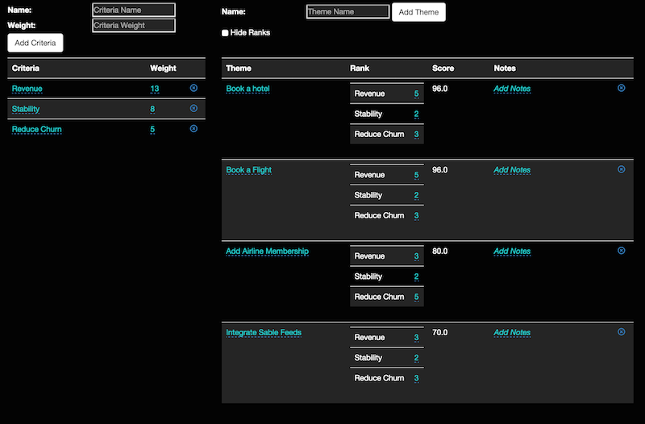

# Theme Scoring

[Mike Cohn](https://www.mountaingoatsoftware.com), author of [Agile Estimating and Planning](https://www.mountaingoatsoftware.com/books/agile-estimating-and-planning), introduced the [Theme Scoring approach to prioritizing Product Backlogs](https://www.mountaingoatsoftware.com/blog/new-tools-for-prioritizing-backlogs-available). As a Product Owner and former Certified Scrum Trainer who used to teach the Theme Scoring approach, I built a tool that I use and thought could be useful for others applying this approach to thier prioritization efforts.

## Build

Run `grunt` for building

## Run Application

In order to provide some access control, the Theme Scoring application uses basic authentication. To set the basic authentication credentials for your environment, you must create two environment variables with your own username and password values:

```
$ export TS_USERNAME=<username>
$ export TS_PASSWORD=<password>
```

Once these environment variables are set, run `npm start` for preview at http://localhost:9000. After adding criteria and themes the application should look something like the following:



This will save your data in the local storage on your browser. This means that the data you put in will only be available in the browser you run the application in.

To persist the data in a database, it is currently configured to accept credentials for [Orchestrate](https://orchestrate.io) when the following environment variables are set in your environment:

```
$ export ORCHESTRATE_API_KEY=<key>
$ export ORCHESTRATE_API_HOST=api.orchestrate.io
```

## Using the Application

The Theme Scoring technique involves scoring themes of work based on criteria that is driving priority decisions. To get started, I recommend thinking of the top 3 criteria that drive priority decisions. In the example above, the following criteria were used:

* Revenue with weight of 13
* Reduce Churn with weight of 5
* Stability with weight of 8

The weight is relative to each other. In the example criteria above, Revenue is currently driving decisions more than Reducing Churn and Stability.

You can have any number of criteria but it is good to start with a few that are easy to think of and then add some themes to test out the criteria against. Each theme can then be ranked against each criteria. Typically you would use a rank of 1 to 5 where:

* 3 is little impact to that criteria
* less than 3 it has negative impact on that criteria
* more than 3 it has positive impact on that criteria

Just click on the number, which defaults to 3, and enter a number between 1 and 5. After entering a rank, the score will be updated with the formula:

* Each criteria is scored by `rank * criteria weight`
* The score is sum of all criteria scores

The list of themes will automatically reorder with each criteria ranked. Right now the user experience is not optimal so you may lose the theme you are ranking criteria for so be careful. The application will be updated once I know folks are using it and are asking for new capabilities and experience optimizations. For now, it meets my needs.

## Deploying to Cloud Foundry

There is a manifest.yml file that helps Cloud Foundry to deploy your application. I recommend changing the name value in the manifest.yml file to a unique name so that you don't collide with someone else who is deploying their own Theme Scoring application. To deploy, log in to your Cloud Foundry, set the target space to deploy to, and then push your app using the following command after you change the name:

```
$ cf push
```

## Testing

Running `grunt test` will run the unit tests with karma.
